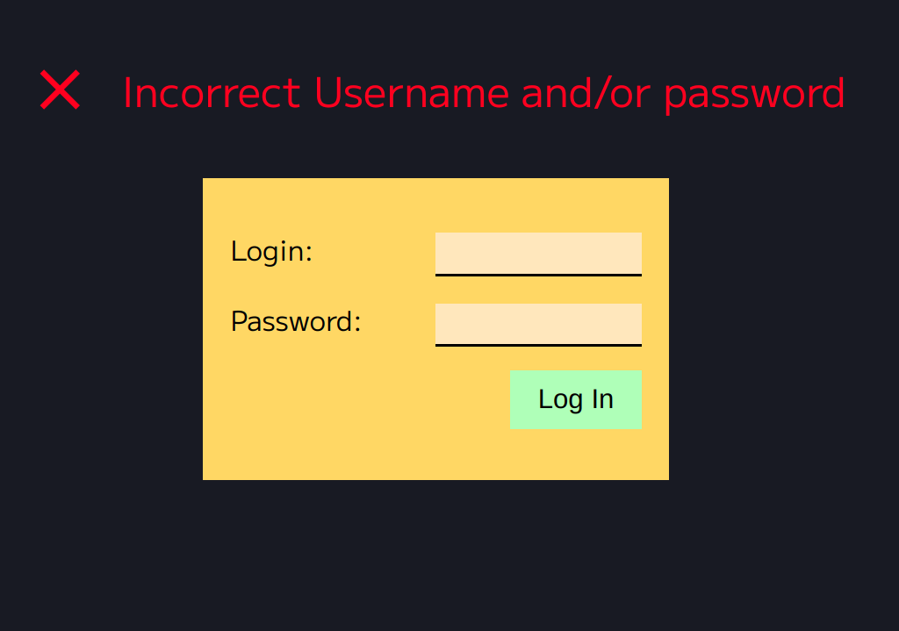
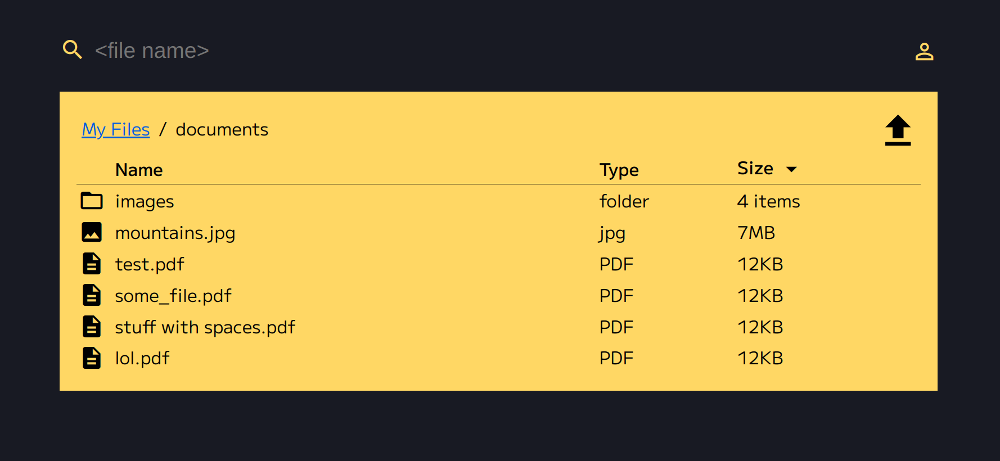

# frontend challenge

## Overview
Very basic dropbox clone as described in [frontend challange](https://github.com/gravitational/careers/blob/main/challenges/frontend/challenge.md)

at level 5

### summary requirements

#### Priorities: 
1. Limited Time  
   - functionalities will be kept to minimum 
   - only directly mentioned requirements are going to be implemented
2. Security
   - I will follow [OWASP cheatsheet](https://cheatsheetseries.owasp.org/)
   - to the extent that time will allow
3. Quality
   - Project will be written test first 
   - though frontend will be written styleguide first 
     - and test will be limited, especially when managing quirks would be to time expensive

#### User interface
##### What is going to be done
 1. List files and directories in a chosen directory 
 2. Navigate directories
 3. Search and sort files
 4. User Authentication

##### What is not going to be done
 1. no user authentication related operations (only login)
 2. no file and directory management: no rename, move delete copy (only upload and list)
 3. no file upload

#### Backend
##### What is going to be done
1. API 
   1. for login 
   2. for directory listing (with authentication verification)
2. file storage
   1. file repository implementation will be files read from folder inside docker
   2. default directory structure

##### What is not going to be done
 1. no writeable repository
    1. users will be hardcoded

#### Infrastructure
##### What is going to be done
1. project will be build into single docker image
##### What is not going to be done
1. Deployment
2. Continuous Integration pipeline on github actions to keep project in shape

#### Security
##### 
1. user authentication opaque token based
2. minimal package requirements
3. OWASP ZAP tests
4. reduce exposed information by frontend wih 2 builds based on the same sources
   1. login page 
      - publicly available
      - only with login page dependencies
   2. file manager 
      - available after authentication
      - only with resources necessary for file management
5. file reading protection (path traversal attacks)
   1. setup directory in docker where files would be accessible and run the app with user that can only access this path
   2. filter path requested by the user (though it's hard to filter out all possible wierdness) - and this stage is probably unnecessary
   3. verify path again after canonicalization by https://pkg.go.dev/path/filepath Abs
6. open redirects 
   1. when not logged in user will request file manager (/files/<some path>)
   2. app will try to validate requested hostname and path 
   3. then create a secure, http only, samesite cookie with path only, if it's correct 
   4. redirect to /login 
   5. on /login Login SPA will be loaded 
   6. after successful login API will validate cookie content again 
   7. and respond with the path to which Login SPA should redirect itself
7. password hashing
   1. Argon2id
8. CSRF 
   1. double submit cookie

##### Bad things - that should be fixed for real world scenario
1. self made ssl certificate 
2. remote loaded fonts and Icons 
3. hardcoded credentials
4. yarn fetches packages every time

## architecture 

### security
 - to expose as little information as possible 
     
   unauthenticated users will receive only login form essential assets.

### 5 components
 app has 5 major components, that could be separated into couple services and authentication proxy
- primary functionality - file management
    1. frontend
    2. backend
- secondary functionality - authentication modules
    3. authentication wrapper (authorize or redirect to login)
    4. login fronted
    5. login backend
    

### keep things simple
- to keep things simple, it's going to be auth wrapper on protected resources handlers
    - 1 backend in GO
        - that hosts login assets on one path
        - files manager assets on the other
        - implements login and file management REST API
    - 1 frontend in TypeScript with 2 builds to 
        - login SPA
        - files manager SPA 

### authentication flow

## Frontend

## Tools
 - prettier
 - TypeScript 
 - React
 - React Router
 - storybook
 - jest
 - dynamically loaded fonts and icons (as font)

### Pages

#### not authenticated = login page

#### File list page - authenticated 

#### file details page

## Backend

### tools
- testify
- golangci-lint

### routes / paths

#### Auth
- POST /API/v1/user/login json {user: string, password: string} 
- ANY  /API/v1/user/logout

#### Files
  all requests here need to be authenticated

  v1 - just a nice touch to make new api versions easily updatable in the future (even though there is no future ;) 
 - GET /API/v1/files/:path? - path should be more of a "slug", generated by the server to deal with wierd cases
   - [{name: "wier$$$ stufff\\", slug: "wierd___stufff", size: 12342, type: "folder|\<file extension\>"}]

#### static resources
 - /login - unprotected, all users only what's needed to render login form
 - /files - protected, authenticated users 
 - / - redirect to /files and from /files to /login if user is not authenticated

